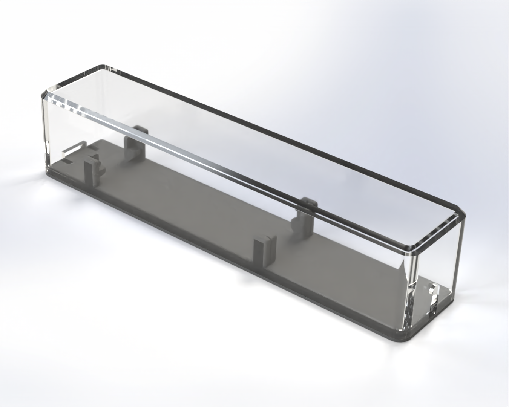

# USB-zu-M-Bus-Gehäuse

- Zugentlastung für RJ12-Kabel mittels Kabelbinder
- Platz für einen USB-A-Female-Stecker (Verlängerungskabel)
- Integrierte Halterung für die Platine
- Snap-Deckel

(Das Oberteil des Gehäuses wurde zu Illustrationszwecken transparent dargestellt.)
